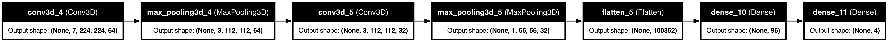
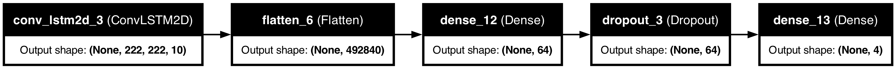
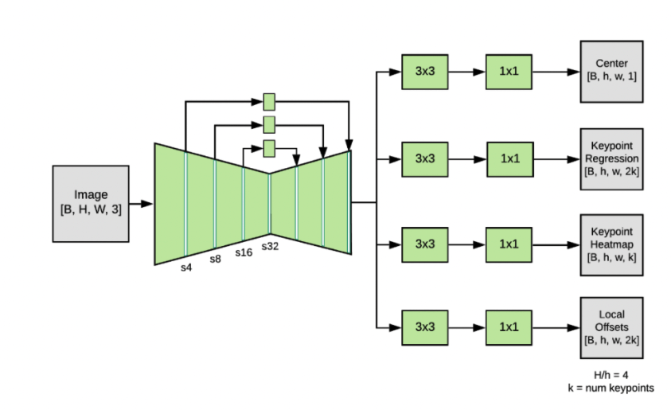

# Capstone Project - Ace Advantage: Serve Optimization for Tennis Players

> Author: Ngan Han Kiong
---

## Overview

Tennis, being a highly dynamic and skill-based sport, demands precision and efficiency in every aspect of play. Among these, the serve stands out as one of the most crucial shots, often dictating the flow and outcome of a match. Mastering the serve requires not only strength and technique but also a keen understanding of body positioning and movement.

Traditionally, coaches and players rely on subjective assessments or costly motion capture systems to analyze and optimize the tennis serve. However, recent advancements in computer vision and deep learning have opened up new possibilities for understanding human movement with remarkable accuracy and affordability.

## Persona

Alex, a seasoned tennis coach, brings over 15 years of experience to the court. 
Passionate about player development, he seeks innovative, data-driven solutions to optimize serves and gain a competitive edge in tournaments. 
Alex's goal is to help players of all levels reach their full potential while staying ahead of industry trends and technology advancements. 
With a focus on enhancing serve accuracy, power, and placement, Alex navigates challenges and pressures to maintain his reputation as a top-tier coach, driven by a commitment to excellence and success on the court.

## Problem Statement

How might we develop a data-driven approach to analyze serve performance data and develop personalized strategies for optimizing serve accuracy, power, and placement, thereby empowering tennis players to enhance their on-court performance and gain a competitive edge in matches?

## Data Sources

- Data sourced from the [Tennis Match Charting Project](https://github.com/JeffSackmann/tennis_MatchChartingProject).
- Recordings of tennis matches from [TennisTV](https://www.tennistv.com/)
- Recordings of tennis serves videos from [YouTube](https://www.youtube.com/)

[Data required for the notebooks can be obtained from this link](https://drive.google.com/drive/folders/1-rfgudMgdzlRARMM11O5Pwyv5OCMrSbN?usp=sharing)

## Notebooks

- `01_Predicting_Tennis_Serve_Outcomes.ipynb`
- `02_Pose_Detection_and_Analysis.ipynb`

## Methodology

There are 2 parts to this project 
Part 1: Predicting tennis serves outcomes
Part 2: Pose detection and analysis

For part 1 of the project: 
1. Data collection
2. Data annotations
3. Frame extractions
4. Loading and Preprocessing of Frames
5. Modelling
6. Conclusions and Recommendations

For part 2 of the project: 
1. Install and Import Required Libraries
2. Download MoveNet Model
3. Load the Model
4. Define Utility Functions
5. Define Visualization Functions
6. Define Data Analysis Functions
7. Process Video Data
8. Biomechanical Analysis of Tennis Serve Techniques
9. Conclusions and Recommendations

## Models and Model Evaluation

Part 1 Prediction of Tennis Serves Outcomes: 
Model 1 Architecture: 3D-CNN

Model 2 Architecture: Convolutional LSTM

Comparison of the models:

| Attributes               | Model 1                                           | Model 2                                           |
|--------------------------|---------------------------------------------------|---------------------------------------------------|
| Model                    | Sequential                                        | Sequential                                        |
| Number of Hidden Layers  | 4 (Two Conv3D, One Dense, One MaxPooling)         | 3 (One ConvLSTM2D, One Dense, One Dropout)        |
| Activation Functions     | ReLU (Conv3D, Dense), Softmax (Dense)             | ReLU (Dense), Softmax (Dense)                     |
| Optimizer                | Adam                                              | Adam                                              |
| Loss Functions           | Categorical Crossentropy                          | Categorical Crossentropy                          |

Part 2 Pose Estimation and Analysis: 
Pre-trained model: MoveNet

## Results

Part 1 Prediction of Tennis Serves Outcomes

Comparison of accuracy and loss for the models:

| Epoch | Accuracy Model 1 | Accuracy Model 2 | Loss Model 1 | Loss Model 2 |
|-------|------------------|------------------|--------------|--------------|
| 1     | 0.2760           | 0.2786           | 1.3864       | 1.3863       |
| 2     | 0.2355           | 0.2401           | 1.3864       | 1.3864       |
| 3     | 0.2616           | 0.2661           | 1.3863       | 1.3862       |
| 4     | 0.2714           | 0.2522           | 1.3862       | 1.3864       |
| 5     | 0.2447           | 0.2676           | 1.3863       | 1.3863       |
| 6     | 0.2632           | 0.2815           | 1.3862       | 1.3861       |
| 7     | 0.2245           | 0.2743           | 1.3864       | 1.3862       |
| 8     | 0.2709           | 0.2714           | 1.3862       | 1.3862       |
| 9     | 0.2451           | 0.2765           | 1.3866       | 1.3863       |
| 10    | 0.2611           | 0.2706           | 1.3862       | 1.3860       |
| Test  | 0.2536           | 0.2536           | 1.3866       | 1.3868       |

Overall Interpretation
- Model Effectiveness: Neither Model 1 nor Model 2 shows effective learning or improvement in performance over the training period. This might suggest problems with the network architecture's suitability for the task, possible issues with data quality or labeling, or a need for different hyperparameters (like learning rate adjustments).

Part 2 Pose Estimation and Analysis
Biomechanical Analysis of Tennis Serve Techniques

The tennis serves of professionals and amateurs are analysed via: 
1. Descriptive analysis: Histograms and boxplots of right elbow angles, right shoulder angles, right knee angles, right wrist (x and y-coordinates) are plotted.

| Measurement                  | Group         | Median | Mean | Distribution Characteristics                                                                   | Additional Insights                                    |
|------------------------------|---------------|--------|------|-----------------------------------------------------------------------------------------------|-------------------------------------------------------|
| **Right Wrist X-Coordinates** | Professionals | 0.2    | 0.3  | Slightly right-skewed, concentrated around center. High variability in lower x-coordinates.  | Most data points are lower, indicating controlled movement. |
|                              | Amateurs      | 0.4    | 0.5  | Noticeably right-skewed, wrist positions further to the right. Outliers suggest extreme positions. | Wider spread may affect shot effectiveness.           |
| **Right Wrist Y-Coordinates** | Professionals | 0.2    | 0.4  | Right-skewed, positions mostly lower but capable of high reach.                               | Indicates a technique involving lower wrist positions.      |
|                              | Amateurs      | 0.3    | 0.3  | Symmetric across the vertical range, less reach to the top compared to professionals.         | Less variability in height during play.               |
| **Right Elbow Angles**        | Professionals | 65     | 75.2 | Narrower interquartile range (40 to 110 degrees), consistent technique with acute angles.     | Optimized for power, reflects consistent technique.   |
|                              | Amateurs      | 110    | 103.2  | Broader interquartile range (60 to 160 degrees), higher variability and less optimal biomechanics. | Indicates potential inefficiency in serve mechanics.  |
| **Right Shoulder Angles**     | Professionals | 56.4   | 68.7 | Distribution shows dynamic technique with high variability and some extreme values.            | Ability to vary technique dynamically.                |
|                              | Amateurs      | 36.1   | 48.4 | Less extreme angles, tighter concentration around the median despite a wide range.              | Suggests less aggressive techniques.                  |
| **Right Knee Angles**         | Professionals | 64.9   | 75.2 | Predominantly moderate flexion, indicating stable and powerful stance.                         | Conducive to effective play.                          |
|                              | Amateurs      | 112.3  | 103.2| Higher knee flexion, suggesting less efficient movement and a potential area for technique improvement. | Higher flexion may indicate inefficiencies.           |

Comparative Insights:
- Wrist Positioning: Professionals maintain closer, more central wrist alignments conducive to controlled, precise strokes, whereas amateurs exhibit a wider spread potentially affecting shot effectiveness.
- Elbow and Shoulder Angles: Lower and more consistent elbow angles in professionals suggest optimized serve mechanics compared to amateurs. Shoulder angle data reveal professionals’ ability to vary technique dynamically, a contrast to the less aggressive approaches seen in amateurs.
- Knee Flexion: Professionals use a more moderate knee flexion conducive to effective play, while amateurs’ higher flexion may indicate inefficient technique that could benefit from refinement.

2. Time series analysis: Line plots of left and right wrist (y-coordinates), left and right wrist (x and y-coordinates), right elbow angles, right shoulder angles and right knee angles over time are plotted. 

| Aspect                           | Professional Players                                                                                      | Amateur Players                                                                                           |
|----------------------------------|----------------------------------------------------------------------------------------------------------|-----------------------------------------------------------------------------------------------------------|
| **Y-Positions of Wrists**        | Smooth, periodic oscillations with consistent amplitude. Complementary and synchronized wrist movements. | Oscillatory with greater variability and irregular amplitude. Less pronounced phase relationship.         |
| **X and Y Positions of Wrists**  | Distinct, regular patterns in both horizontal and vertical movements, indicating precise stroke execution.| Erratic and less defined patterns, especially in vertical movements. Greater variability and less control.|
| **Right Elbow Angle**            | Smooth, consistent changes in angle, demonstrating controlled and precise motions for optimal serves.     | Fluctuating and erratic movements, indicating less biomechanical efficiency and control.                   |
| **Right Shoulder Angle**         | Controlled, consistent movements within a moderate range, supporting efficient power transfer.            | Significant fluctuations, suggesting inconsistencies that could impact serve effectiveness.               |
| **Right Knee Angle**             | Stable and controlled knee movements, maintaining an effective base for powerful and accurate serves.     | Greater variability and less controlled movements, suggesting a less stable base for effective serves.     |

3. Correlation analysis: Scatterplots of left and right wrist (y-coordinates) with right elbow angles, left and right wrist (x-coordinates) with right elbow angles are plotted. Correlation heatmaps of right wrist (x and y-coordinates) are plotted.

| Group         | Scatterplots of Wrist X-Positions and Right Elbow Angles                                                  | Scatterplots of Wrist Y-Positions and Right Elbow Angles                                       | Correlation Heatmaps of Right Wrist Positions and Right Elbow Angles                                                                                                         |
|---------------|-----------------------------------------------------------------------------------------------------------|------------------------------------------------------------------------------------------------|-------------------------------------------------------------------------------------------------------------------------------------------------------------------------------|
| **Professionals** | Clear positive correlation with dense clustering; higher elbow angles correlate with larger wrist x-values. | Weak negative correlation; consistent technique indicated by clustering in lower-left quadrant. | Moderate positive correlation (0.35) between right elbow angles and right wrist x-coordinates; weak positive correlation (0.11) with right wrist y-coordinates.                |
| **Amateurs**     | Positive correlation but less defined; varied techniques with a less distinct elbow-wrist relationship.     | No clear correlation; high variability and scattered points across the plot.                    | Weak positive correlation (0.21) between right elbow angles and right wrist x-coordinates; weak negative correlation (-0.21) with right wrist y-coordinates. Moderate negative correlation (-0.32) between right wrist x and y-coordinates. |

4. Statistical analysis: t-tests for right elbow angle, right shoulder angle, right knee angle are plotted. 

| Measurement             | T-Statistic | P-Value | Interpretation                                                                                                                                                 |
|-------------------------|-------------|---------|----------------------------------------------------------------------------------------------------------------------------------------------------------------|
| **Right Elbow Angle**   | -21.27      | < 0.0001| Significant difference between groups, with professionals having more acute elbow angles, indicating refined technique and strength utilization.               |
| **Right Shoulder Angle**| 17.11       | < 0.0001| Statistically significant higher shoulder angles in professionals, suggesting superior technique and biomechanics.                                             |
| **Right Knee Angle**    | -21.27      | < 0.0001| Significant difference, with professionals showing lower knee angles, possibly reflecting more effective power generation and injury prevention strategies.  |

## Conclusion and Recommendations

Part 1 Prediction of Tennis Serves Outcomes

Conclusions:
- Model Performance: The models tested did not demonstrate significant learning or improvement over the training period. Both models showed a consistent performance with an accuracy of around 25.36%, which suggests that the models might be struggling with the complexity of the task or issues related to data quality.
- Loss Metrics: Both models exhibited nearly constant loss values across all training epochs, suggesting that neither model effectively reduced its error rate, possibly indicating that the models reached a local minimum.

Recommendations:
- Model and Data Reevaluation: Given the consistent but underwhelming performance of both models, it would be beneficial to revisit the model architectures or consider more complex models that might better capture the nuances of tennis serves.
- Hyperparameter Tuning: Adjusting hyperparameters such as the learning rate, increasing the number of epochs, or employing more sophisticated data augmentation techniques could potentially enhance the model's ability to learn from the data.
- Data Quality and Preprocessing: Reassessing the data preprocessing steps to ensure that the input data is optimally prepared for the models could also help. It might be useful to explore different ways of segmenting or augmenting the data to provide more varied learning examples.

Part 2 Pose Estimation and Analysis

Conclusions: 
1. Shoulder Angle Optimization:
- Professionals often utilize lower shoulder angles, typically between 23.4 to 32.1 degrees, optimizing power and control.
- Amateurs display a broader range of shoulder angles, with a peak around 64.1 to 73.8 degrees, indicating a less consistent and possibly less effective technique.
2. Elbow and Knee Angle Differences:
- There is a significant difference in elbow and knee angles between professional and amateur players, with professionals using angles that likely enhance stability and efficiency, while amateurs show greater variability and less biomechanical advantage.
3. Statistical Significance:
- A t-statistic of -21.27 with a p-value near zero confirms a significant difference in right knee angles between the two groups, suggesting different biomechanical strategies or conditioning.

Recommendations: 
1. Machine Learning Models
- Predictive Modeling: Develop machine learning models to predict outcomes of serves (e.g., successful, fault) based on pose data. Techniques such as logistic regression, decision trees, or more complex models like Random Forests and SVM can be used to understand what features most significantly predict serve success.
2. Advanced Clustering Techniques
- Segmentation of Player Styles: Use advanced clustering techniques to segment players or serves into distinct styles or types based on biomechanical data. This can help in customizing coaching strategies to player-specific needs.
3. Biomechanical Simulation and Modeling
- Simulate Serve Motions: Use the data to create biomechanical models that simulate different serve techniques. These models can help in visualizing the serves and understanding the mechanical loads on different body parts.

## References

1. [New York Times article “The Toss”](https://www.nytimes.com/interactive/2022/08/28/sports/tennis/tennis-serve-ball-toss.html)
2. [Nick Kyrgios Serve Compilation | Includes Slow Motion | Tennis](https://www.youtube.com/watch?v=T4YlusgCKfs)
3. [TennisCraft Match Database](https://www.tenniscraft.nyc/match-database)
4. [Predicting tennis serves outcomes](https://www.youtube.com/watch?v=d3Z_eJfPACs)
5. [Can AI Make You a Better Athlete?](https://daleonai.com/machine-learning-for-sports)
6. [Tensorflow Multi-Person Pose Estimation with Python](https://github.com/nicknochnack/MultiPoseMovenetLightning)

